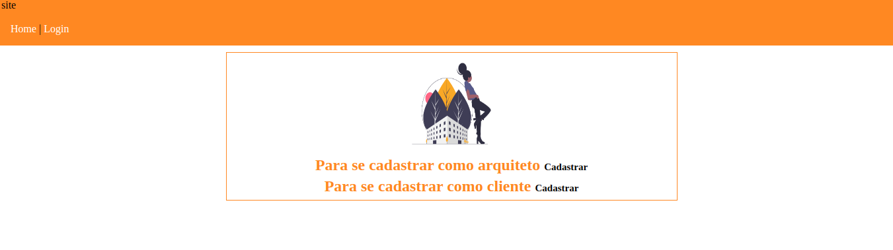
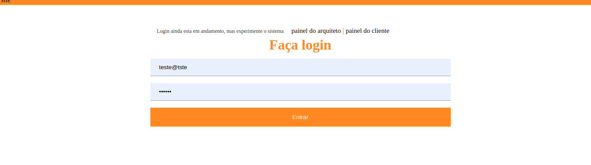
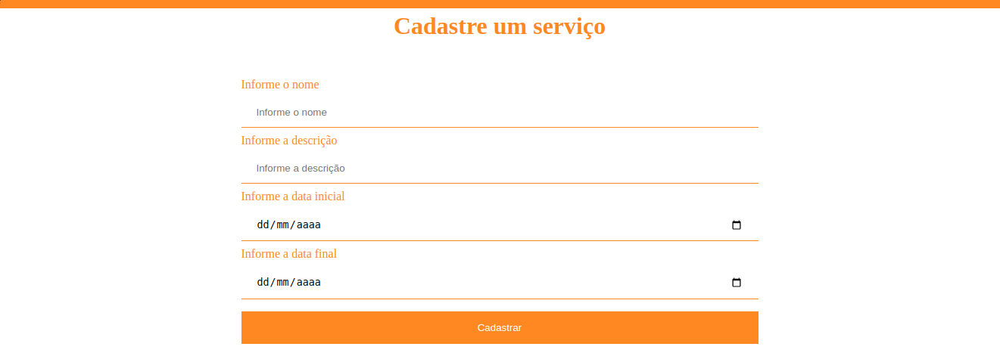

# arquitetofrontend
### Construir um fluxo de cadastro e listagem dos cadastrados
Um grupo de arquitetos tiveram uma brilhante ideia de criar um site onde clientes pudessem se registrar e procurar arquitetos cadastrados, podendo solicitar serviço através de um formulário.
Primeiramente os arquitetos precisam criar uma conta para depois acessar um painel das solicitações de serviços, podendo aceitar, recusar ou excluir solicitações (Quem sabe poderem restaurar excluídos).
Os arquitetos cadastrados precisam aparecer em uma listagem para os clientes selecionarem um arquiteto e enviar uma solicitação de serviço. Vale lembrar que esses clientes precisam se cadastrar também.
Interessante ter um local onde os clientes conseguissem ver as solicitações que fizeram para excluir ou editar.

### Ambos precisam ter informações como Nome, E-mail, Telefone, Gênero, idade, etc.
O formulário de serviço pode conter qualquer informação, mas a descrição do serviço solicitado é obrigatória.
Validações de formulários em ambas as frentes.
As solicitações precisam ter estados como Solicitada, Aceita e Recusada.
Testes unitários são sempre bem vindos, assim como um código limpo e fácil de ler.

## Project setup
```
npm install
```

### Compiles and hot-reloads for development
```
npm run serve
```

### Compiles and minifies for production
```
npm run build
```

### Lints and fixes files
```
npm run lint
```
## o sistema possui;
### Cadastro de usuário, arquitetos, serviço.
### É possível que o usuário veja todos arquitetos cadastrados e enviar um serviço para ele, 
### É possível o arquiteto ver todos os serviços para ele e definir se aceita, recusa ou exclui a solicitação de serviço.

### Customize configuration
See [Configuration Reference](https://cli.vuejs.org/config/).
## pagina home


## pagina login


## pagina cadastrar serviços 

 
